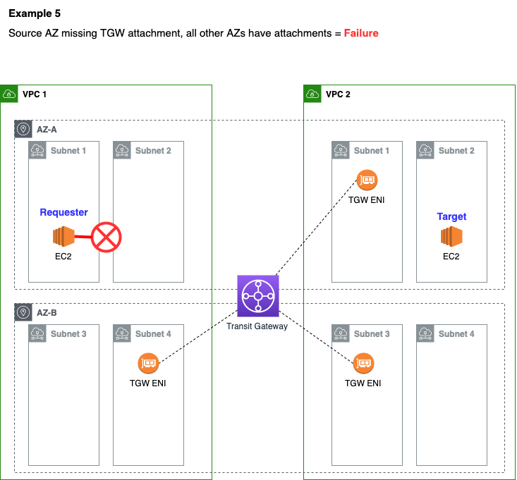
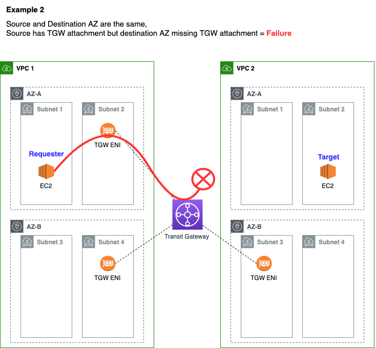
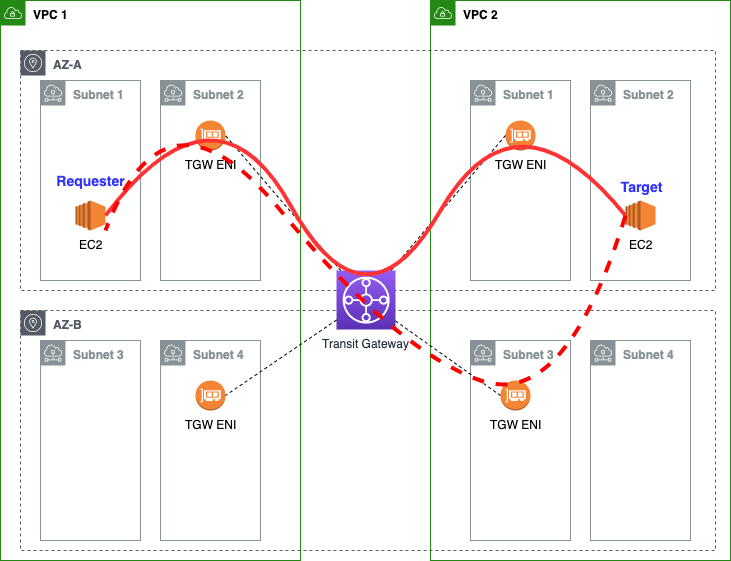
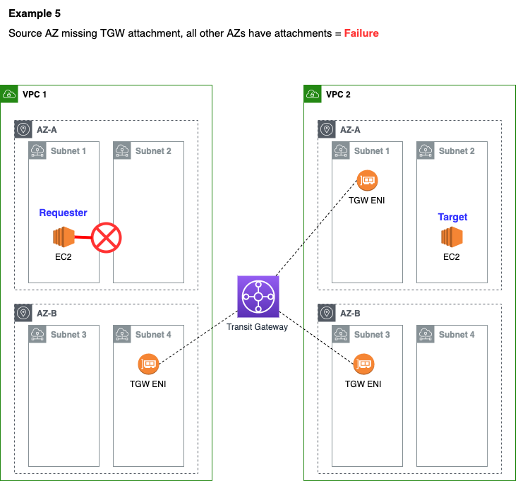

# AWS Transit Gateway Routing Diagrams

This project contains diagrams to help you understand [AWS Transit Gateway (TGW)](https://aws.amazon.com/transit-gateway/) routing.

## Disclaimer

These diagrams are based on my personal understanding as of October 2020. As always, refer to official AWS documentation for confirmation and/or updates.

## Key Takeaways

1. A transit gateway "attachment" is an Elastic Network Interface (ENI)

2. In a given VPC, one, and only one, subnet per AZ can have an attachment to a given TGW.

3. A requests source AZ *must* have a TGW attachment in one of its subnets to reach TGW destinations.

4. A target's destination AZ *must* have a TGW attachment to receive traffic from TGW.

5. The source and destination AZs *do not* have to be the same. 

6. When source and destination AZs are different, routing may vary depending on which AZs have attachments. This is better explained by comparing Example 3 and Example 4, below. 

7. When source and target VPCs are in the same AWS account, an AZ (such as us-east-1a) refers to the same physical data centers. 

8. When source and target VPCs are in different AWS accounts, an AZ (such as us-east-1a) might refer to different physical data centers.[Read more about this here](https://docs.aws.amazon.com/ram/latest/userguide/working-with-az-ids.html). At the end of the day, as long as the source and destination AZs both have TGW attachments, it doesn't impact connectivity across the TGW (but might mean traffic is crossing AZs).

## Diagrams

### Example 1

Below, the source and destination EC2 are in the same AZ and both AZs have a TGW attachment. The TGW attachment is in a different subnet than the EC2 instances, but that does not matter. 

### Example 2

Here, the source AZ has a TGW attachment, but the destination AZ does not. The target is therefore not reachable over the TGW.

The TGW attachment in VPC-2 AZ-B **cannot** be used to route cross-AZ traffic to the target in VPC-2 AZ-A. 

### Example 3

Here, the source and target are in different AZs. In the destination VPC, both AZ A and AZ B have a TGW attachment. 

Traffic exiting the TGW into VPC-2 will always leave from the TGW attachment in the same AZ as the source AZ (in this case, AZ-A). From there, it can successfully route to the target's AZ (AZ-B) because AZ-B has a TGW attachment.

### Example 4

Here, the source and target are again in different AZs. However, this time, the destination VPC only has a TGW attachment in the target AZ (AZ-B) and does not have an attachment in the same AZ as the sender (AZ-A).

This is also successful. In this case, traffic will exit the TGW directly in the target AZ, AZ-B.

### Example 5

In this example, the source AZ does not have a TGW attachment. In this scenario, the source AZ (regardless of subnet) will never be able to reach the TGW.

### Credits

Thanks to my colleague Hrushi Gangur for helping advise on these diagrams.
