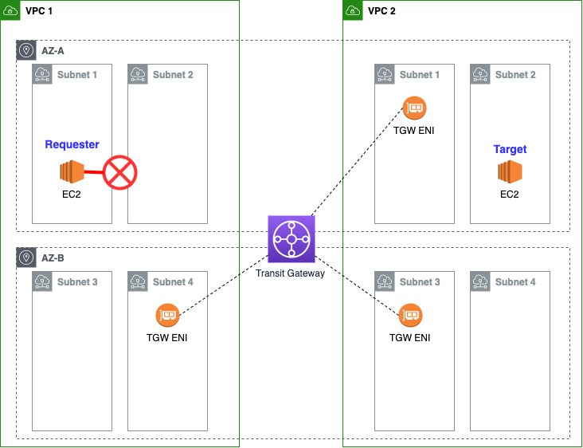
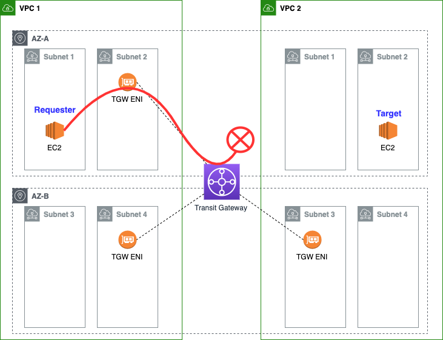
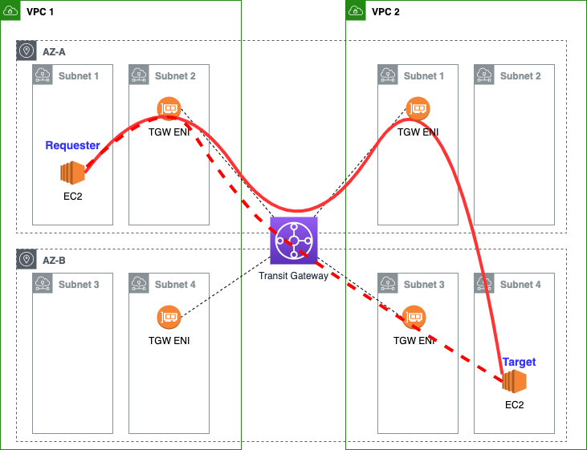
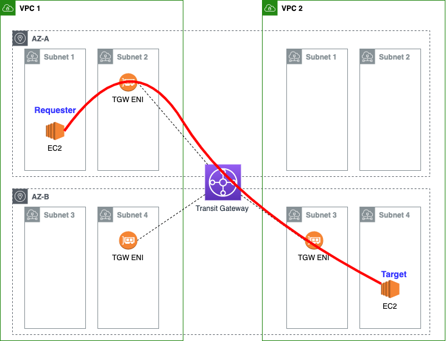

# AWS Transit Gateway Routing Diagrams

This project contains diagrams to help you understand [AWS Transit Gateway (TGW)](https://aws.amazon.com/transit-gateway/) routing.

## Diagrams

### Example 1

When the source AZ does not have a TGW attachment, the destination AZ is always unreachable:

### Example 2

When the destination AZ does not have a TGW attachment, the destination AZ is always unreachable via TGW:

### Example 3

When the source and destination AZs are the same and both AZs have a TGW attachment, the routing will prefer to exit the TGW via the attachment in the same AZ (AZ-A) via the bold red path. However, it's *possible* that traffic might exit via the red dotted line in destination AZ-B and then cross over to final target in AZ-A via the red dotted line:

### Example 4

When the destination AZ is different from the source AZ, but the destination AZ has a TGW attachment, will again (like Example 1) prefer to exit in via the attachment in the same AZ as the source (AZ-A) and then route cross-AZ to the final target via the bold red line. However, it's *possible* that some traffic may exit directly via the attachment in the destination AZ (AZ-B) via the red dotted line:

### Example 5

When the source AZ and destination AZ are different, and the destination VPC does **not** have a TGW attachment in the same AZ as the source but does have an attachment in the target AZ, the traffic will always route as follows:

### Example 6

Like example 5, the destination VPC does not have a TGW attachment in the same AZ as the source (AZ-A). However, this time, the destination VPC has a TGW attachment in both the target AZ (AZ-B) and one other AZ (AZ-C).

Traffic exiting TGW will prefer to exit via the bold red line in the target AZ (AZ-B), but its *possible* that some traffic may exit in AZ-C via the dotted red line and then cross AZs to the final target in AZ-B:

### Credits

Thanks to my colleague Hrushi Gangur for helping advise on these diagrams.
